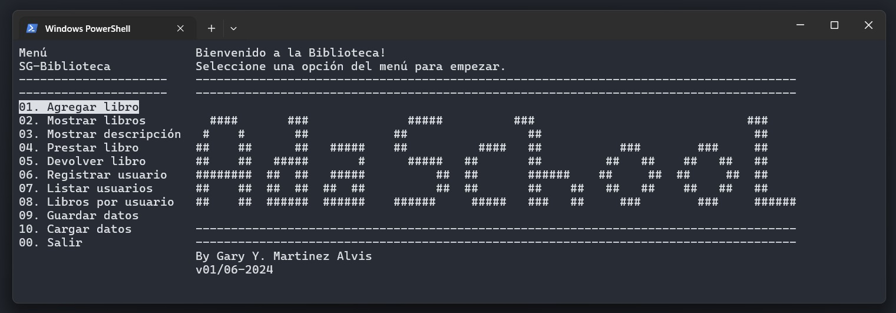

# App Sistema de Gestión de Biblioteca 

**By Gary Y. Martinez Alvis**   
**Junio 2024**

---

# Descripción
Aplicación de terminal desarrollada con python para gestionar una biblioteca. La aplicación permite administrar de manera eficiente la gestión de libros y usuarios de una biblioteca, la aplicación cuenta con una distribución de contenido visual, con el menú ubicado en el panel izquierdo y la información y solicitud de parametros en el panel derecho de la aplicación.

A continuación la distrubución del menú y sus funcionalidades: 

**Administración de libros:** Del menú 01-05 se encuentran las opciones para la gestión de libros en las cuales se listan, agregar libro, mostrar libros, mostrar descripción del libro, prestar libro y devolver libro.

**Gestión de usuarios:** El menú 06-08 se encuentran las opciones para la gestión de usuarios en las cuales se listan, registrar usuario, listar usuario y libros por usuario.

**Administración:** El menú 09-10 estan las opciones de guardar datos y cargar datos, siendo opciones de administración de la aplicación.

---



---

# Estructura del proyecto


---
# Guía de instalación y uso de la aplicación 
### Step 1: Clonar repositorio 

Dentro del directorio que alojara la aplicación abrir una terminal e ingresar el siguiente comando.

```git
git clone https://github.com/GaryMartAlvis/app_SG-Biblioteca.git
```

### step 2: Creación de entorno virtual

Este paso se realiza siguiente buenas prácticas de programación la cual evita que librerias utilizadas en este proyecto se instalen el nivel global.
Dentro del directorio de la aplicación `app_sg_bibilioteca`, en tu terminal seguir los siguiente comandos para la instalación y activación del entorno virtual.
```bash
# SO-Windows
python -m venv venv
.\venv\Scripts\activate
```

### Step 3: Instalación de dependencias

Este paso realiza la instalación de dependencias en tu entorno virtual para que la aplicación cuente con los recurso necesarios para funcionamiento.
```bash
pip install -r requirements.txt
``` 

### Step 4: Ejecución aplicación

En este paso ejecutarás la aplicación desde tu terminal con el siguiente comando.
```bash
python .\main.py
```

Con este breve tutoria estaras listo para explorar las funcionalidade de la aplicación.

Nota: La aplicación cuenta con su base de datos de prueba en el archivo `datos_biblioteca.pkl`, para probar las funcionalidades de la aplicación desde 0 eliminar el archivo de datos de prueba.